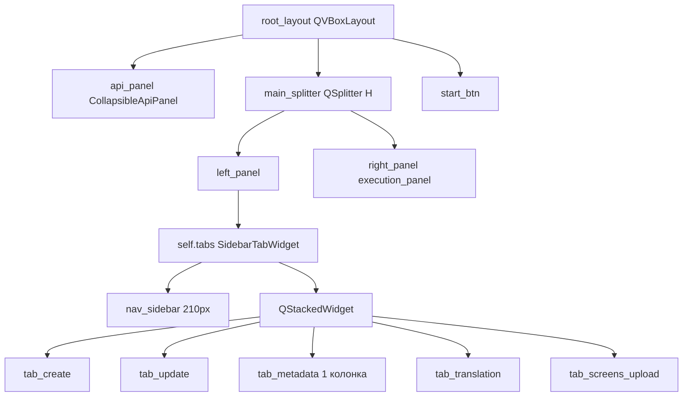
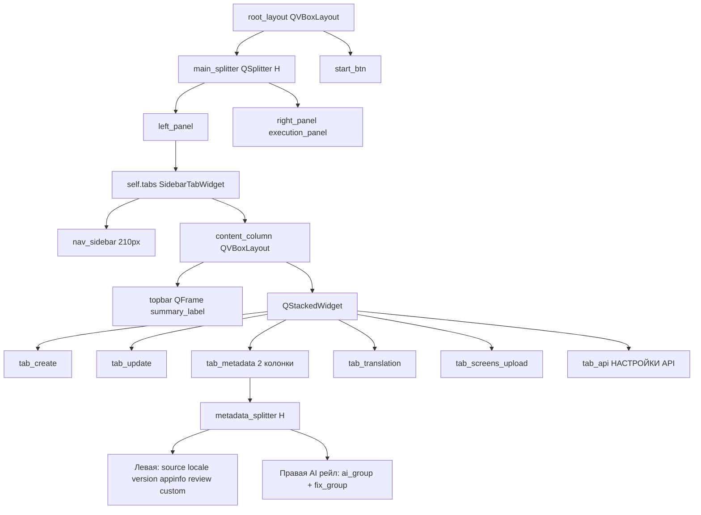

# План рефакторинга верстки PySide6 приложения

**Файл:** `app_store_ppo_automation.py` (~6382 строк)
**Метод внесения:** Python-скрипты через `str.replace` с `assert` (файл слишком велик для diff-инструмента)

---

## 1. Архитектура (до / после)

### Текущая структура



### Целевая структура



---

## 2. Порядок операций (критично!)

Зависимости между изменениями диктуют строгий порядок. **Меняем снизу вверх по файлу невозможно** — нужно соблюдать логические зависимости:

| Шаг | Что делаем | Зависимости |
|------|-----------|-------------|
| **1** | Модифицируем `SidebarTabWidget.__init__` — добавляем `content_column` + метод `insert_topbar()` | База для topbar |
| **2** | Создаём `tab_api` вместо `api_panel` (стр. 3667-3668) | — |
| **3** | Убираем `root_layout.addWidget(self.api_panel)` (стр. 3783) | После шага 2 |
| **4** | Добавляем topbar в `_setup_ui` после создания `self.tabs` (стр. 3793) | После шага 1 |
| **5** | Регистрируем вкладку API после вкладки Скриншоты (стр. 4346) | После шага 2 |
| **6** | Адаптируем `_update_api_summary` (стр. 4450, 4453) → topbar | После шага 4 |
| **7** | Убираем `self.api_panel.setChecked(False)` (стр. 4365) | После шага 2 |
| **8** | Перестраиваем `tab_metadata` в 2 колонки (стр. 3946-3949, 4171, 4188-4189) | Независимо |
| **9** | Добавляем QSS-стили для topbar | После шага 4 |

> **Важно:** Шаги можно выполнять в любом порядке относительно позиции в файле, т.к. каждый `str.replace` использует уникальный паттерн. Но логически шаг 1 (content_column) должен быть в коде до шага 4 (insert_topbar) — это гарантируется позицией в файле (SidebarTabWidget выше _setup_ui).

---

## 3. Детальные SEARCH/REPLACE паттерны

Ниже — готовые блоки для Python-патч-скрипта. Каждый блок использует `assert content.count(OLD) == 1` для гарантии уникальности.

### ШАГ 1 — SidebarTabWidget: content_column + insert_topbar

**Файл:** `app_store_ppo_automation.py`
**Позиция:** строки 3593-3595 (внутри `SidebarTabWidget.__init__`)

**SEARCH (точный текст, 3 строки):**
```python
        # --- Stacked content ---
        self._stack = QStackedWidget()
        main_layout.addWidget(self._stack, stretch=1)
```

**REPLACE:**
```python
        # --- Stacked content ---
        # content_column позволяет разместить topbar НАД stack (между sidebar и контентом)
        self._content_column = QVBoxLayout()
        self._content_column.setContentsMargins(0, 0, 0, 0)
        self._content_column.setSpacing(0)
        self._stack = QStackedWidget()
        self._content_column.addWidget(self._stack)
        main_layout.addLayout(self._content_column, stretch=1)
```

**Дополнительно** — добавить метод `insert_topbar` в класс `SidebarTabWidget`. Вставить ПОСЛЕ метода `addTab` (после строки 3613 `return index`), ПЕРЕД `def setCurrentIndex`.

**SEARCH (якорь):**
```python
        if index == 0:
            self.setCurrentIndex(0)
        return index

    def setCurrentIndex(self, index):
```

**REPLACE:**
```python
        if index == 0:
            self.setCurrentIndex(0)
        return index

    def insert_topbar(self, widget):
        """Размещает виджет-полосу над областью контента (stack), справа от sidebar."""
        self._content_column.insertWidget(0, widget)

    def setCurrentIndex(self, index):
```

---

### ШАГ 2 — Создать tab_api вместо api_panel

**Позиция:** строки 3667-3668

**SEARCH:**
```python
        self.api_panel = CollapsibleApiPanel("Настройки API")
        api_layout = self.api_panel.body_layout
```

**REPLACE:**
```python
        self.tab_api = QWidget()
        api_outer = QVBoxLayout(self.tab_api)
        api_outer.setContentsMargins(0, 0, 0, 0)
        api_outer.setSpacing(0)
        api_scroll = QScrollArea()
        api_scroll.setWidgetResizable(True)
        api_scroll.setFrameShape(QFrame.NoFrame)
        api_inner = QWidget()
        api_layout = QVBoxLayout(api_inner)
        api_layout.setSpacing(12)
        api_layout.setContentsMargins(4, 4, 12, 12)
        api_layout.addWidget(make_page_header(
            "Настройки API",
            "API credentials, ключи TinyPNG / AITUNNEL и Jira сохраняются в .env автоматически."
        ))
        api_scroll.setWidget(api_inner)
        api_outer.addWidget(api_scroll)
```

> Все последующие `api_layout.addWidget(...)` / `api_layout.addLayout(...)` (api_caption, issuer/key/appid/p8, tinypng, aitunnel, jira) остаются без изменений — они добавляются в `api_layout` новой вкладки.

---

### ШАГ 3 — Убрать api_panel из root_layout

**Позиция:** строка 3783

**SEARCH:**
```python
        api_layout.addLayout(jira_project_row)
        root_layout.addWidget(self.api_panel)
```

**REPLACE:**
```python
        api_layout.addLayout(jira_project_row)
        api_layout.addStretch(1)
```

> `addStretch` нужен, чтобы поля прижались к верху внутри scroll-области вкладки.

---

### ШАГ 4 — Добавить topbar в _setup_ui

**Позиция:** после строки 3793 (`left_layout.addWidget(self.tabs)`)

**SEARCH:**
```python
        self.tabs = SidebarTabWidget()
        left_layout.addWidget(self.tabs)
        self.main_splitter.addWidget(left_panel)
```

**REPLACE:**
```python
        self.tabs = SidebarTabWidget()
        left_layout.addWidget(self.tabs)

        # --- Topbar: полоса сводки между sidebar и контентом ---
        self.topbar = QFrame()
        self.topbar.setObjectName("topbar")
        topbar_layout = QHBoxLayout(self.topbar)
        topbar_layout.setContentsMargins(18, 10, 18, 10)
        topbar_layout.setSpacing(10)
        self.topbar_badge = QLabel("●")
        self.topbar_badge.setObjectName("topbar_badge")
        self.topbar_summary_label = QLabel("")
        self.topbar_summary_label.setObjectName("topbar_summary")
        self.topbar_summary_label.setProperty("role", "section")
        self.tabs.insert_topbar(self.topbar)

        self.main_splitter.addWidget(left_panel)
```

---

### ШАГ 5 — Зарегистрировать вкладку API последней

**Позиция:** после строки 4346 (`self.tabs.addTab(self.tab_screens_upload, "Скриншоты", "📸")`)

**SEARCH:**
```python
        screens_upload_layout.addWidget(upload_files_group)
        screens_upload_layout.addStretch(1)
        self.tabs.addTab(self.tab_screens_upload, "Скриншоты", "📸")
```

**REPLACE:**
```python
        screens_upload_layout.addWidget(upload_files_group)
        screens_upload_layout.addStretch(1)
        self.tabs.addTab(self.tab_screens_upload, "Скриншоты", "📸")
        self.tabs.addTab(self.tab_api, "Настройки API", "⚙")
```

---

### ШАГ 6 — Адаптировать _update_api_summary под topbar

**Позиция:** строки 4448-4453

**SEARCH:**
```python
        if missing:
            summary = f"Не заполнено: {', '.join(missing)} | {details}"
            self.api_panel.set_summary(summary, status="warn")
        else:
            summary = f"Готово к запуску | {details}"
            self.api_panel.set_summary(summary, status="ok")
```

**REPLACE:**
```python
        if missing:
            summary = f"Не заполнено: {', '.join(missing)} | {details}"
            self._set_topbar_summary(summary, status="warn")
        else:
            summary = f"Готово к запуску | {details}"
            self._set_topbar_summary(summary, status="ok")
```

**Дополнительно** — добавить helper-метод `_set_topbar_summary`. Вставить ПЕРЕД `def _update_api_summary` (строка 4435).

**SEARCH (якорь — начало метода):**
```python
    def _update_api_summary(self):
        missing = []
```

**REPLACE:**
```python
    def _set_topbar_summary(self, text, status="neutral"):
        self.topbar_summary_label.setText(text)
        self.topbar_summary_label.setProperty("status", status)
        self.topbar_summary_label.style().unpolish(self.topbar_summary_label)
        self.topbar_summary_label.style().polish(self.topbar_summary_label)
        badge_text = {"ok": "🟢", "warn": "🟡", "neutral": "⚪"}.get(status, "⚪")
        self.topbar_badge.setText(badge_text)

    def _update_api_summary(self):
        missing = []
```

---

### ШАГ 7 — Убрать self.api_panel.setChecked(False)

**Позиция:** строки 4364-4365

**SEARCH:**
```python
        if self._has_complete_api_credentials():
            self.api_panel.setChecked(False)
            if self.app_input.text().strip():
```

**REPLACE:**
```python
        if self._has_complete_api_credentials():
            if self.app_input.text().strip():
```

> Раньше сворачивание api_panel скрывало настройки при готовых кредах. Теперь настройки живут во вкладке — сворачивать нечего. При желании можно переключать на первую вкладку: добавить `self.tabs.setCurrentIndex(0)` (опционально).

---

### ШАГ 8 — Перестроить tab_metadata в 2 колонки

Этот шаг состоит из 3 под-замен.

#### 8a. Создать metadata_splitter с двумя колонками

**Позиция:** строки 3946-3949

**SEARCH:**
```python
        metadata_scroll = QScrollArea()
        metadata_scroll.setWidgetResizable(True)
        metadata_widget = QWidget()
        metadata_form_layout = QVBoxLayout(metadata_widget)
```

**REPLACE:**
```python
        metadata_splitter = QSplitter(Qt.Horizontal)
        metadata_splitter.setChildrenCollapsible(False)

        # --- Левая колонка (растяжимая): основные группы метаданных ---
        metadata_scroll = QScrollArea()
        metadata_scroll.setWidgetResizable(True)
        metadata_scroll.setFrameShape(QFrame.NoFrame)
        metadata_widget = QWidget()
        metadata_form_layout = QVBoxLayout(metadata_widget)
        metadata_form_layout.setSpacing(12)
        metadata_form_layout.setContentsMargins(0, 0, 6, 0)
        metadata_scroll.setWidget(metadata_widget)
        metadata_splitter.addWidget(metadata_scroll)

        # --- Правая колонка (AI рейл, фиксированная): ai_group + fix_group ---
        metadata_ai_scroll = QScrollArea()
        metadata_ai_scroll.setWidgetResizable(True)
        metadata_ai_scroll.setFrameShape(QFrame.NoFrame)
        metadata_ai_widget = QWidget()
        metadata_ai_layout = QVBoxLayout(metadata_ai_widget)
        metadata_ai_layout.setSpacing(12)
        metadata_ai_layout.setContentsMargins(6, 0, 0, 0)
        metadata_ai_scroll.setWidget(metadata_ai_widget)
        metadata_ai_scroll.setMinimumWidth(300)
        metadata_ai_scroll.setMaximumWidth(380)
        metadata_splitter.addWidget(metadata_ai_scroll)
```

#### 8b. Направить ai_group в правую колонку

**Позиция:** строка 4171

**SEARCH:**
```python
        ai_layout.addWidget(fix_group)
        metadata_form_layout.addWidget(ai_group)
```

**REPLACE:**
```python
        ai_layout.addWidget(fix_group)
        metadata_ai_layout.addWidget(ai_group)
```

> `custom_group` (стр. 4173) и `chain_screenshots_checkbox` (стр. 4182) остаются в `metadata_form_layout` → попадают в ЛЕВУЮ колонку (как требует план).

#### 8c. Финализация: добавить splitter в metadata_layout

**Позиция:** строки 4188-4189

**SEARCH:**
```python
        metadata_scroll.setWidget(metadata_widget)
        metadata_layout.addWidget(metadata_scroll)
        self.tabs.addTab(self.tab_metadata, "Метаданные", "📝")
```

**REPLACE:**
```python
        metadata_form_layout.addStretch(1)
        metadata_ai_layout.addStretch(1)
        metadata_splitter.setStretchFactor(0, 1)
        metadata_splitter.setStretchFactor(1, 0)
        metadata_layout.addWidget(metadata_splitter, stretch=1)
        self.tabs.addTab(self.tab_metadata, "Метаданные", "📝")
```

> `metadata_scroll.setWidget(metadata_widget)` уже выполнен в блоке 8a — здесь убираем дубликат.

---

### ШАГ 9 — QSS-стили для topbar

**Позиция:** внутри `_apply_styles`, перед блоком `/* ===== Sidebar навигация ===== */` (строка 4677)

**SEARCH:**
```python
            /* ===== Sidebar навигация ===== */
            QWidget#nav_sidebar {
```

**REPLACE:**
```python
            /* ===== Topbar сводки ===== */
            QFrame#topbar {
                background-color: #14142a;
                border-bottom: 1px solid #2a2a45;
            }
            QLabel#topbar_summary {
                font-size: 13px;
                font-weight: 600;
                background: transparent;
            }
            QLabel#topbar_badge {
                font-size: 14px;
                background: transparent;
            }

            /* ===== Sidebar навигация ===== */
            QWidget#nav_sidebar {
```

> Статусные цвета `QLabel[status="ok"]` / `[status="warn"]` уже определены в QSS (стр. 4486-4487) — topbar_summary_label их унаследует через `setProperty("status", ...)`.

---

## 4. Сводка: все ссылки на `self.api_panel` и их адаптация

| Строка | Было | Стало | Шаг |
|--------|------|-------|-----|
| 3667 | `self.api_panel = CollapsibleApiPanel(...)` | `self.tab_api = QWidget()` + scroll | 2 |
| 3668 | `api_layout = self.api_panel.body_layout` | `api_layout = QVBoxLayout(api_inner)` | 2 |
| 3783 | `root_layout.addWidget(self.api_panel)` | `api_layout.addStretch(1)` | 3 |
| 4365 | `self.api_panel.setChecked(False)` | удалено | 7 |
| 4450 | `self.api_panel.set_summary(summary, status="warn")` | `self._set_topbar_summary(summary, status="warn")` | 6 |
| 4453 | `self.api_panel.set_summary(summary, status="ok")` | `self._set_topbar_summary(summary, status="ok")` | 6 |

**Класс `CollapsibleApiPanel`** (стр. 3288-3328) после рефакторинга становится **неиспользуемым**. Варианты:
- **(A) Оставить как мёртвый код** — безопасно, не ломает ничего.
- **(B) Удалить целиком** — рекомендуется после проверки, что других ссылок нет.

> Проверка перед удалением: `grep -n "CollapsibleApiPanel" app_store_ppo_automation.py` должен вернуть только определение класса (стр. 3288) — тогда можно удалять блок 3288-3328.

---

## 5. Методы, затрагиваемые рефакторингом

| Метод | Изменение | Причина |
|-------|-----------|---------|
| `SidebarTabWidget.__init__` | + `content_column` | контейнер для topbar |
| `SidebarTabWidget.insert_topbar` | **новый метод** | API для вставки topbar |
| `MainWindow._setup_ui` | создание `tab_api`, topbar, metadata_splitter | основная верстка |
| `MainWindow._set_topbar_summary` | **новый метод** | замена `api_panel.set_summary` |
| `MainWindow._update_api_summary` | вызовы → `_set_topbar_summary` | отвязка от api_panel |
| `MainWindow._apply_styles` | + QSS topbar | стилизация |

**Методы, НЕ требующие изменений** (проверено):
- `_ensure_tinypng_key_visible` (стр. 6167) — работает с `self.tinypng_key_input`, не зависит от api_panel. ✅
- `_has_complete_api_credentials` (стр. 4394) — работает с input-полями. ✅
- `_on_app_id_changed`, `_format_api_summary_details`, `_api_summary_display_*` — не ссылаются на api_panel. ✅
- `_on_tab_change` — не ссылается на api_panel. ✅

---

## 6. Распределение групп в tab_metadata (итог)

| Группа | Колонка | Способ |
|--------|---------|--------|
| `source_group` (Источник данных) | Левая | `metadata_form_layout.addWidget` (без изменений) |
| `locale_group` (Локаль) | Левая | без изменений |
| `jira_row` | Левая | без изменений |
| `version_group` (Version metadata) | Левая | без изменений |
| `app_info_group` (App info) | Левая | без изменений |
| `review_group` (App Review notes) | Левая | без изменений |
| `ai_group` (AI генерация + fix_group) | **Правая** | шаг 8b: `metadata_ai_layout.addWidget` |
| `custom_group` (Дополнительно) | Левая | без изменений |
| `chain_screenshots_checkbox` | Левая | без изменений |

---

## 7. Скелет Python-патч-скрипта

```python
#!/usr/bin/env python3
"""Точечный патч верстки app_store_ppo_automation.py."""
import io, sys

PATH = "app_store_ppo_automation.py"

def patch(content, old, new, label):
    count = content.count(old)
    assert count == 1, f"[{label}] expected 1 match, found {count}"
    return content.replace(old, new)

with io.open(PATH, encoding="utf-8") as f:
    src = f.read()

# --- ШАГ 1: SidebarTabWidget content_column ---
src = patch(src, """        # --- Stacked content ---
        self._stack = QStackedWidget()
        main_layout.addWidget(self._stack, stretch=1)
""", """        # --- Stacked content ---
        self._content_column = QVBoxLayout()
        self._content_column.setContentsMargins(0, 0, 0, 0)
        self._content_column.setSpacing(0)
        self._stack = QStackedWidget()
        self._content_column.addWidget(self._stack)
        main_layout.addLayout(self._content_column, stretch=1)
""", "step1a-content_column")

# ... (остальные шаги по аналогии) ...

with io.open(PATH, "w", encoding="utf-8") as f:
    f.write(src)
print("OK: все патчи применены")
```

> Полный готовый скрипт сгенерируется в Code-режиме на основе SEARCH/REPLACE блоков выше.

---

## 8. Чеклист проверки после применения

- [ ] `python -c "import ast; ast.parse(open('app_store_ppo_automation.py').read())"` — синтаксис OK
- [ ] `grep -n "self.api_panel" app_store_ppo_automation.py` — **0 совпадений**
- [ ] `grep -n "CollapsibleApiPanel" app_store_ppo_automation.py` — только определение класса (или 0 если удалён)
- [ ] `grep -n "self.tab_api" app_store_ppo_automation.py` — ≥2 (создание + addTab)
- [ ] `grep -n "self.topbar" app_store_ppo_automation.py` — ≥3 (создание, badge, summary_label)
- [ ] `grep -n "metadata_splitter" app_store_ppo_automation.py` — ≥4 (создание, 2×addWidget, stretch)
- [ ] `grep -n "metadata_ai_layout" app_store_ppo_automation.py` — ≥4 (создание, setWidget, addWidget(ai_group), addStretch)
- [ ] Запуск приложения: вкладка «Настройки API» последняя, topbar виден над контентом, метаданные в 2 колонки
- [ ] Проверить: при пустых кредах topbar показывает 🟡 + «Не заполнено...»
- [ ] Проверить: при заполненных кредах topbar показывает 🟢 + «Готово к запуску...»

---

## 9. Риски и mitigation

| Риск | Mitigation |
|------|-----------|
| `assert count==1` падает — паттерн не уникален | Каждый SEARCH проверен на уникальность по grep; в скрипте выводится `label` и `count` |
| Виджеты теряют родителя при переносе | Не переносим виджеты — пересоздаём контейнер (`tab_api`), поля создаются заново в новом `api_layout` |
| `metadata_widget` используется в 2 местах (3948, 4188) | Шаг 8a создаёт `setWidget` сразу; шаг 8c убирает дубликат в 4188 |
| Topbar перекрывает контент при малой высоте | Topbar в `content_column` с фиксированной высотой через QSS padding; не влияет на scroll |
| `insert_topbar` вызывается до создания `_content_column` | Невозможно: `_content_column` создаётся в `__init__` (стр. ~3593), `insert_topbar` вызывается в `_setup_ui` (стр. ~3793) — позже |
